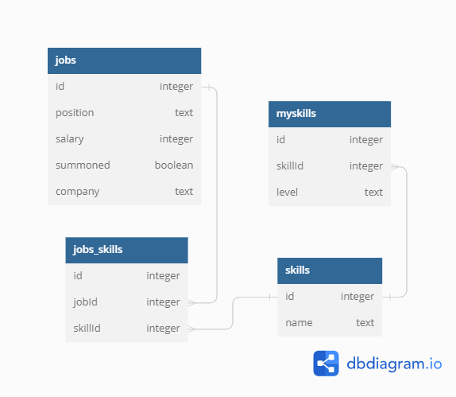

# API básica para gerenciamento de candidaturas pessoais a vagas de empregos

## Rotas

---

**Inserir um _job_: POST /jobs**

Formato do _body_ da requisição:
``` javascript
{
  position: string,
  company: string,
  salary: number
}
```

---

**Assinalar sucesso na convocação para um _job_: PATCH /jobs/:id**

---

**Listar _jobs_: GET /jobs**

Formato da resposta à requisição:
``` javascript
[
  {
    id: number,
    position: string,
    salary: number,
    summoned: boolean,
    company: string,
    jobs_skills: []
  },
  {
    id: number,
    position: string,
    salary: number,
    summoned: boolean,
    company: string,
    jobs_skills: [
      {
        id: number,
        skills: {
          id: number,
          name: string
        }
      },
      {
        id: number,
        skills: {
          id: number,
          name: string
        }
      }
    ]
  }
]
```

---

**Adicionar uma ou várias _skills_ ao banco de dados: POST /skills**

Formato do _body_ da requisição:
``` javascript
[
  {name: string},
  {name: string}
]
```

---

**Adicionar uma ou mais _skills_, fazendo uso de uma lista de _skillIds_, a um _job_: POST /jobskills**:

Formato do _body_ da requisição:
``` javascript
{
  jobId: string,
  skills: [number, number, number]
}
```

---

**Listar _skills_ disponíveis: GET /skills**

Formato da resposta à requisição:
``` javascript
[
  {
    id: number,
    name: string
  },
  {
    id: number,
    name: string
  }
]
```

---

**Inserir uma ou mais _myskills_ juntamente com o(s) _level(s)_ de proficiência: POST /myskills**

Formato do _body_ da requisição:
``` javascript
[
  {
    skillId: number,
    level: string
  },
  {
    skillId: number,
    level: string
  }
]
```

---

**Excluir uma _myskill_: DELETE /myskills/:id**

---

**Atualizar o _level_ sobre uma _myskill_: PATCH /myskills/:id**

Formato da _query_ da requisição:
``` javascript
{
  level: string
}
```

---

**Listar _myskills_: GET /myskills**

Formato da resposta à requisição:
``` javascript
[
  {
    id: number,
    level: string,
    skills: {
      id: number,
      name: string
    }
  },
  {
    id: number,
    level: string,
    skills: {
      id: number,
      name: string
    }
  }
]
```

---

Diagrama entidade-relacionamento:



---